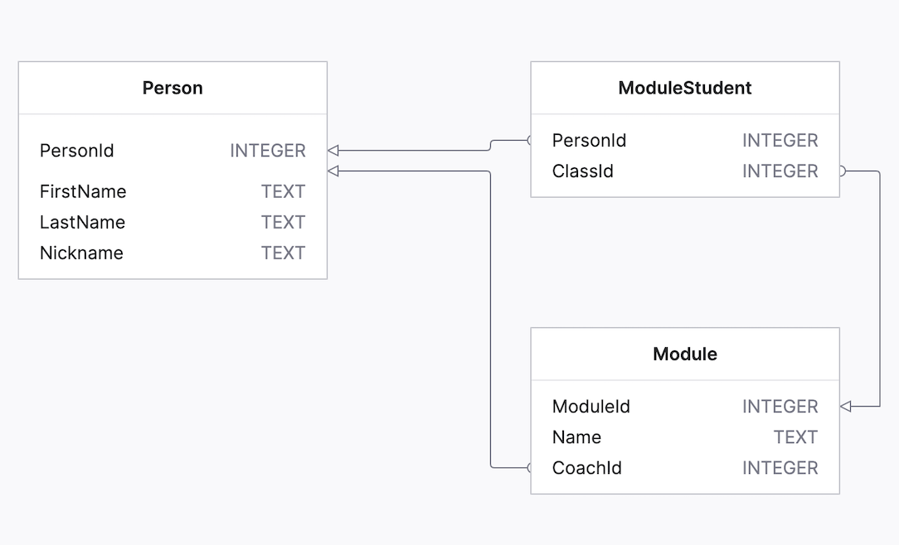

# Week 2
In these exercises we focus solely on writing SQL. You can use the [the online SQLite viewer](https://inloop.github.io/sqlite-viewer/) again or use one of the tools suggested in the previous class.
## Join
<details><summary>1. Show all albums' title and artist name</summary>

```sql
SELECT
	title AS AlbumTitle,
	Artist.Name AS ArtistName
FROM
	Album
	LEFT JOIN Artist ON Artist.ArtistId = Album.ArtistId;

--OR using USING

SELECT
	title AS AlbumTitle,
	Artist.Name AS ArtistName
FROM
	Album
	LEFT JOIN Artist USING(ArtistId);

--OR using NATURAL

SELECT
	title AS AlbumTitle,
	Artist.Name AS ArtistName
FROM
	Album
	NATURAL LEFT JOIN Artist;
```
</details>

<details><summary>2. Show all tracks' name, composer and genre name</summary>

```sql
SELECT
	Track.Name AS TrackName,
	Composer,
	Genre.Name AS GenreName
FROM
	Track
	LEFT JOIN Genre ON Genre.GenreId = Track.GenreId;
```
</details>

<details><summary>3. Show all tracks' name, composer, album name, media type name and genre name</summary>

```sql
SELECT
	Track.Name AS TrackName,
	Composer,
	Album.Title AS AlbumTitle,
	MediaType.Name AS MediaTypeName,
	Genre.Name AS GenreName
FROM
	Track
	LEFT JOIN Genre ON Genre.GenreId = Track.GenreId
	LEFT JOIN Album ON Album.AlbumId = Track.AlbumId
	LEFT JOIN MediaType ON MediaType.MediaTypeId = Track.MediaTypeId;
```
</details>

<details><summary>4. Show all possible combinations of media type and genre a track could have; show media type name and genre name</summary>

```sql
SELECT
	MediaType.Name,
	Genre.Name
FROM
	MediaType
	CROSS JOIN Genre;
```
</details>

<details><summary>5. Show all albums' title and track names</summary>

```sql
SELECT
	title AS AlbumTitle,
	Track.Name AS TrackName
FROM
	Album
	JOIN Track ON Track.AlbumId = Album.AlbumId;
```
</details>

<details><summary>6. Show all employees' full name, title and their superior's full name and title</summary>

```sql
SELECT
	Employee.FirstName || ' ' || Employee.LastName AS EmployeeFullName,
	Employee.Title AS EmployeeTitle,
	Superior.FirstName || ' ' || Superior.LastName AS SuperiorFullName,
	Superior.Title AS SuperiorTitle
FROM
	Employee
	LEFT JOIN Employee AS Superior ON Superior.EmployeeId = Employee.ReportsTo;
```
</details>

<details><summary>7. Show all employees' full name, title and their superior's full name and title only if they have a superior</summary>

```sql
SELECT
	Employee.FirstName || ' ' || Employee.LastName AS EmployeeFullName,
	Employee.Title AS EmployeeTitle,
	Superior.FirstName || ' ' || Superior.LastName AS SuperiorFullName,
	Superior.Title AS SuperiorTitle
FROM
	Employee
	INNER JOIN Employee AS Superior ON Superior.EmployeeId = Employee.ReportsTo;
```
</details>

<details><summary>8. Show the number of invoice lines' per invoice billing country</summary>

```sql
SELECT
	BillingCountry,
	count(*) AS NumberOfInvoiceLines
FROM
	Invoice
	JOIN InvoiceLine ON InvoiceLine.InvoiceId = Invoice.InvoiceId
GROUP BY
	BillingCountry;
```
</details>

<details><summary>9. Show the number of invoices per customer; show customers' full name</summary>

```sql
SELECT
	Customer.FirstName || ' ' || Customer.LastName AS CustomerFullName,
	count(*) AS NumberOfInvoices
FROM
	Invoice
	JOIN Customer ON Customer.CustomerId = Invoice.CustomerId
GROUP BY
	Invoice.CustomerId;
```
</details>

<details><summary>10. Show the total per customer; show customers' full name and total</summary>

```sql
SELECT
	Customer.FirstName || ' ' || Customer.LastName AS CustomerFullName,
	sum(Total) AS Total
FROM
	Invoice
	JOIN Customer ON Customer.CustomerId = Invoice.CustomerId
GROUP BY
	Invoice.CustomerId;
```
</details>

<details><summary>11. Show the full name of the customer with the highest total</summary>

```sql
SELECT
	Customer.FirstName || ' ' || Customer.LastName AS CustomerFullName,
	sum(Total) AS Total
FROM
	Invoice
	JOIN Customer ON Customer.CustomerId = Invoice.CustomerId
GROUP BY
	Invoice.CustomerId
ORDER BY Total DESC
LIMIT 1;
```
</details>

<details><summary>12. Show the invoice total per employee; show employee full name and total</summary>

```sql
SELECT
	Employee.FirstName || ' ' || Employee.LastName AS EmployeeFullName,
	round(sum(Total), 2) AS Total
FROM
	Invoice
	JOIN Customer ON Customer.CustomerId = Invoice.CustomerId
	JOIN Employee ON Employee.EmployeeId = Customer.SupportRepId
GROUP BY
	EmployeeId;
```
</details>

<details><summary>13. Show all invoices for which the total is not equal to the total of all invoice lines' total; show invoices' id, invoices' total, invoice lines' total</summary>

```sql
SELECT
	Invoice.InvoiceId,
	Invoice.Total,
	round(sum(UnitPrice*Quantity), 2) AS InvoiceLinesTotal,
	Total == round(sum(UnitPrice*Quantity), 2) AS IsEqual
FROM
	InvoiceLine
	JOIN Invoice ON Invoice.InvoiceId = invoiceline.InvoiceId
GROUP BY
	Invoice.InvoiceId
HAVING IsEqual = FALSE;

--there are no records because all invoices fortunately add up
```
</details>

## Create, Alter and Drop

<details><summary>14. Create the ERD for the HackYourFuture database (https://diagramplus.com/ is an easy tool to do so)</summary>
	


Note that this is just one possible, albeit simple, solution.
</details>

<details><summary>15. Create the tables according to the ERD</summary>

```sql
CREATE TABLE Person (
	PersonId INTEGER PRIMARY KEY,
	FirstName TEXT NOT NULL,
	LastName TEXT NOT NULL,
	Nickname TEXT
);

CREATE TABLE Module (
	ModuleId INTEGER PRIMARY KEY,
	Name TEXT,
	CoachId INTEGER,
	FOREIGN KEY (CoachId) REFERENCES Person (PersonId)
);

CREATE TABLE ModuleStudent (
	ModuleId INTEGER,
	StudentId INTEGER,
	FOREIGN KEY (ModuleId) REFERENCES Module (ModuleId),
	FOREIGN KEY (StudentId) REFERENCES Person (PersonId),
	UNIQUE (ModuleId, StudentId)
);
```
</details>

## Insert, Update and Delete

With the database structure in place it's time to add some data.

<details><summary>16. Insert the date for your module, your coaches and the students of your group into database</summary>

```sql
INSERT INTO Module (Name)
		VALUES('databases');

--coaches
INSERT INTO Person (FirstName, LastName)
		VALUES('Jane', 'Doe'), ('John', 'Doe');

--students
INSERT INTO Person (FirstName, LastName)
		VALUES('John', 'Roe'), ('Richard', 'Roe'), ('Jane', 'Roe'), ('Baby', 'Doe');
```
</details>

<details><summary>17. Update the coach for the databases module to be Jane Doe</summary>

```sql
UPDATE
	Module
SET
	CoachId = 1
WHERE
	Name = 'databases';
```
</details>

<details><summary>18. Add the students to the database module</summary>

```sql
INSERT INTO ModuleStudent (ModuleId, StudentId)
		VALUES(1, 3), (1, 4), (1, 5), (1, 6);
```
</details>

<details><summary>19. Delete coach John Doe</summary>

```sql
DELETE FROM Person
WHERE PersonId = 2;
```
</details>
